# AppCatch - iOS 설치 및 설정

## iOS Framework 설치 및 설정 방법
모바일 앱에서 발생하는 크래시 정보와 클라이언트의 로그 정보를 수집하여 정확한 분석이 가능하도록 합니다.  
클라이언트의 로그 기록을 통해 클라이언트에서 어떤 로직으로 앱이 동작하는지 확인할 수 있습니다.  
사용자 행동 로직과 크래시 정보를 통해 보다 빠르고 정확하게 개선을 할 수 있으며,  
보다 안전한 앱을 운영하실 수 있도록 도와주는 서비스입니다.  
 <!--  
설치 중 궁금한 사항이 있으시거나, 설치가 잘 되지 않는다면 아래를 통해 언제든지 문의해 주세요.  
- 메일: support@appcatch.io -->

## 지원환경
Appcatch는 다음과 같은 환경에서 원활하게 사용하실 수 있습니다.

##### 지원환경
* iOS 9.0 이상

##### 개발환경
* mac 12.6
* xcode 14.2
* Swift 4.0

## Framework 설치
iOS Framework 설치 방법에 대해 설명합니다.

### Framework 사용자 환경 설정
1. Xcode Project Target Setting 창으로 이동합니다.
2. **General**에서 **Framework,Libraries and Embeded contest** 항목에
    Foundation.framework, libc.tbd, libz.tbd, **YTCraship.xframework** 추가 합니다.
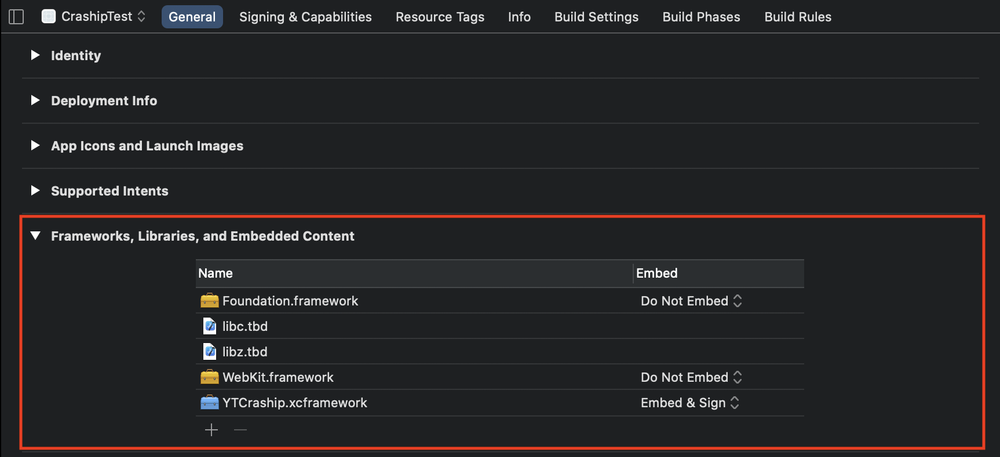
 

1. **Build Settings** 에서 **Framework Search Paths** 경로를 지정 합니다. 
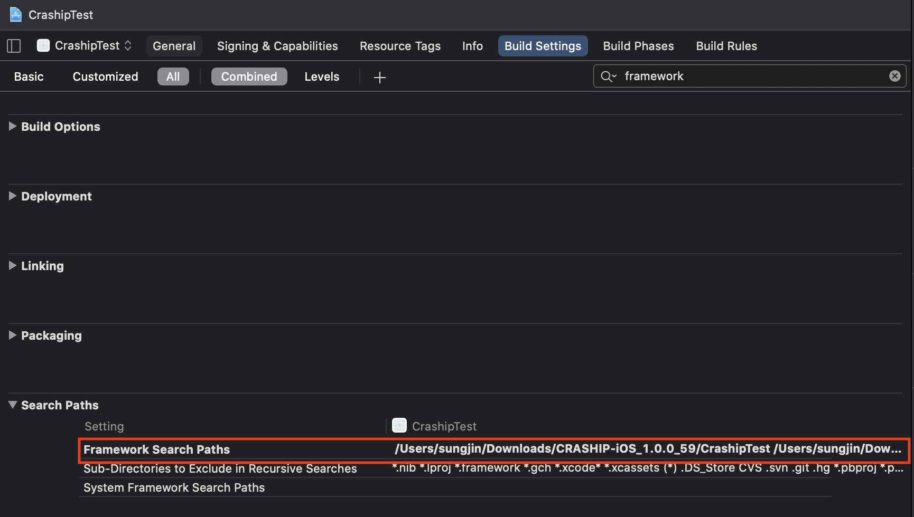
 

1. **Build Phases** 에서 **Link Binary With Libraries** 클릭하여 경로 지정 후 **YTCraship.xframework** 를 추가 합니다.
2. **Embed Frameworks** 항목에 **YTCraship.xcframework** 추가 후 **code sign on Copy** 체크 합니다.
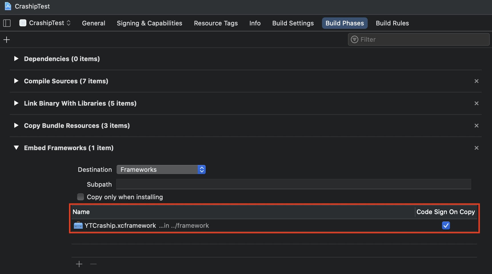
 

### m1 architecture setting
1. 해당 프로젝트에 **BuildSetting** 파일 클릭.
2. **Architectures 항목 -** **Excluded Architectures setting-** 
     **Debug, Release** 필드에 **Any iOS simulator SDK** 필드에 **arm64**를 체크 합니다.
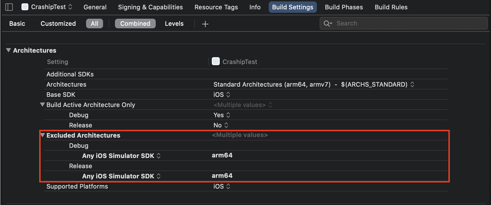
 

### 위치 정보 동의 설정
#### info.plist 설정
1. AppCatch는 사용자 위치 정보를 추출하여 서버로 보내고 있습니다.
2. **info.plist** setting에 아래 항목을 추가 한 후 원하는 메시지를 입력하세요
    **Privacy - Location Always and when in Use Usage Description**
    **Privacy - Location When in Use Usage Decription**
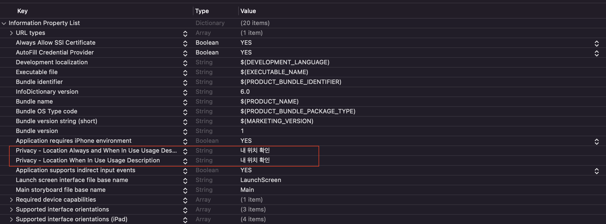
 

## Framework(Objective C) 설치
iOS Framework(Objective C) 설치 방법에 대해 설명합니다.

### Objective C Setting 가이드
1. **Build Setting -> Defines Module = "YES"**
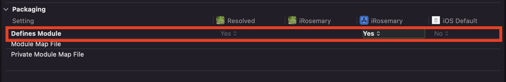

2. 프로젝트에 **swiftWrapper** 파일을 추가 합니다.  
    **2-1) Add Files to**
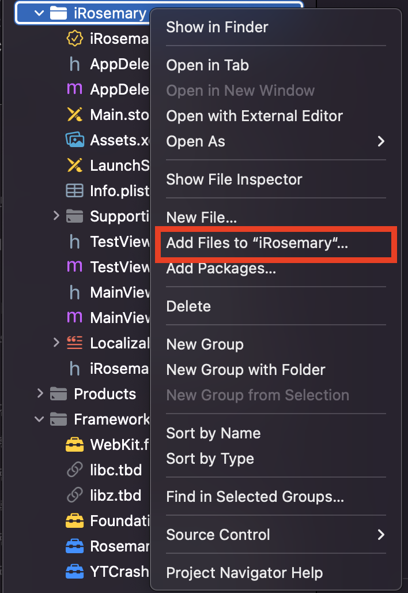
    **2-2) Create groups**
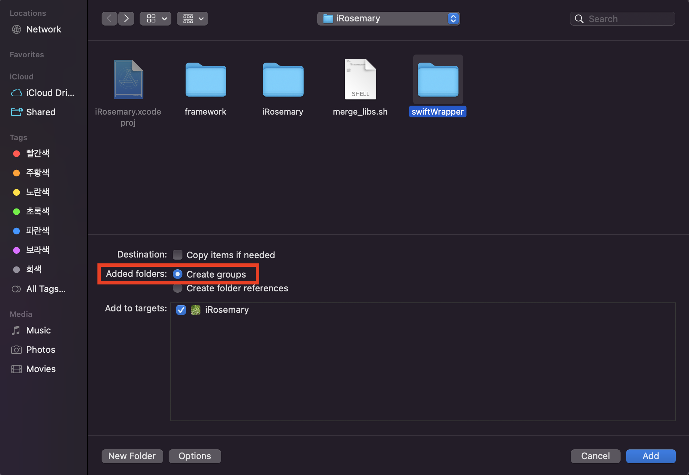
    **2-3) Build Phases -> Complie sources 파일 확인**
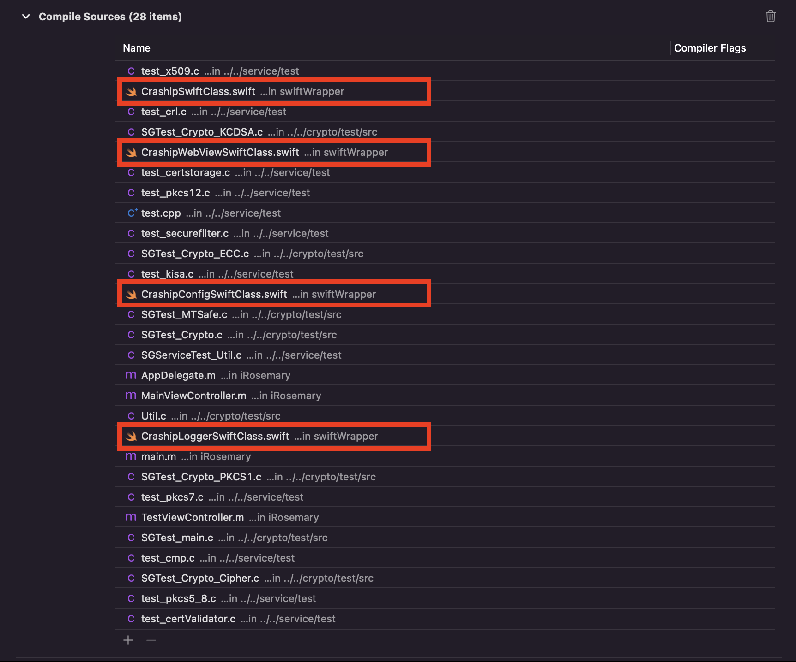

3. Bridging Header 추가 
    **3-1)Create Bridging Header**  
    파일 추가시 Would you like to configure an Objectivec-C bridging Header  
    추가 여부를 물어 볼 경우 **Create Bridging Header**를 클릭합니다 **(xcode에서 자동생성)**
    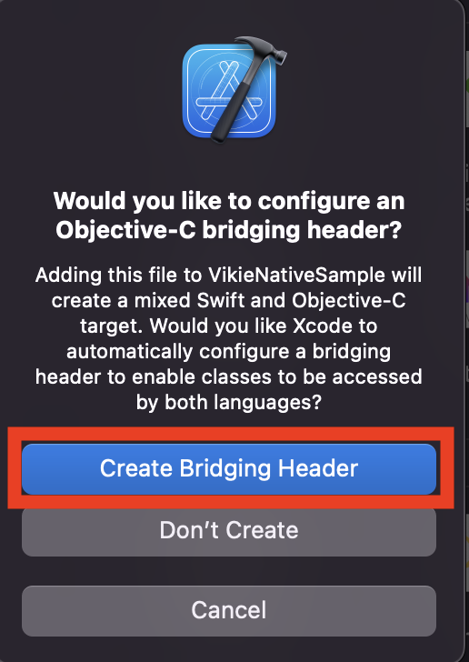 
    **추가 여부를 물어보지 않을 경우 직접 추가 해 줍니다.**
    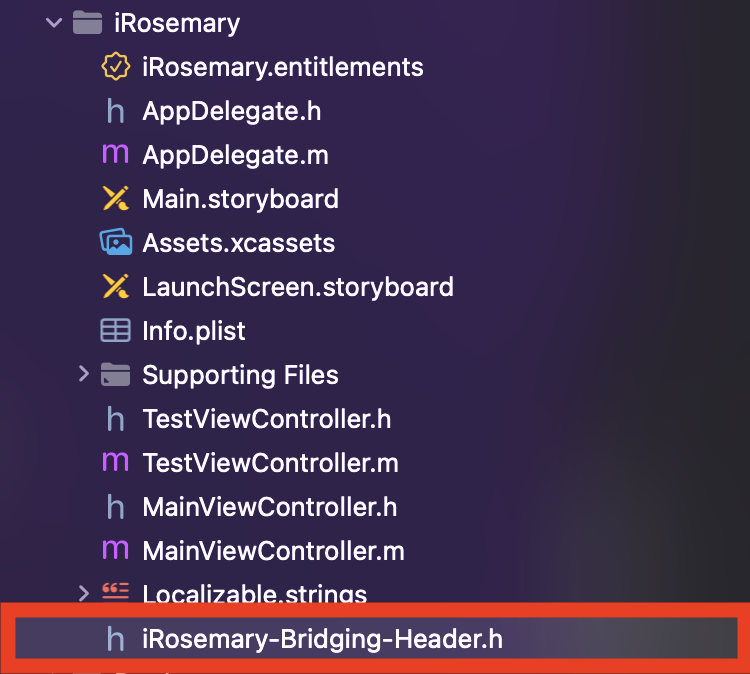
    **Bridge-Header 확인(없을 경우 Swift Module을 찾을 수 없다는 에러를 냅니다.)**
    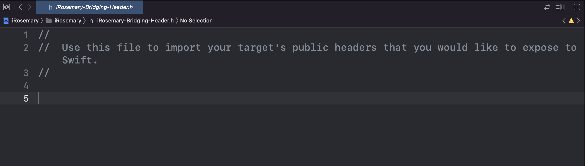 

    **3-2) Build Setting -> Swift Compiler - General** 
    **Bridge-Header path 설정**
    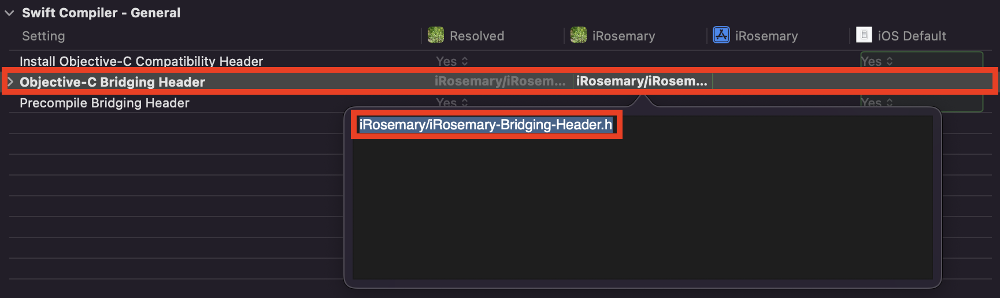 

4. Bridge Header import 
    **4-1)프로젝트이름-Swift.h 파일을 추가합니다**  
    **프로젝트이름 : iRosemary 일 경우 #import iRosemary-Swift.h**
    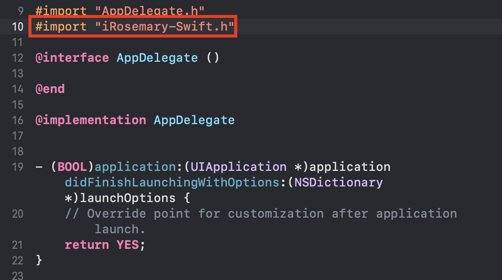 

5. Swift Language Version Setting 
    **5-1)SWIFT_VERSION 셋팅을 진행합니다.**  
    **4.내용까지 진행하여 컴파일 할 경우 SWIFT_VERSION cannot be empty 라는 컴파일 에러가 나옵니다.**
    **Build Setting -> Swift Language Version Setting을 진행 해줍니다.(AppCatch 지원범위는 4.0이상입니다.)**
    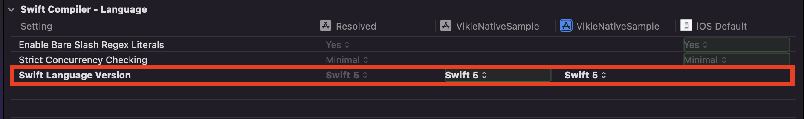 
   
6. Xcode에서 Wrapper 클래스가 호출되는지 확인 합니다. 
   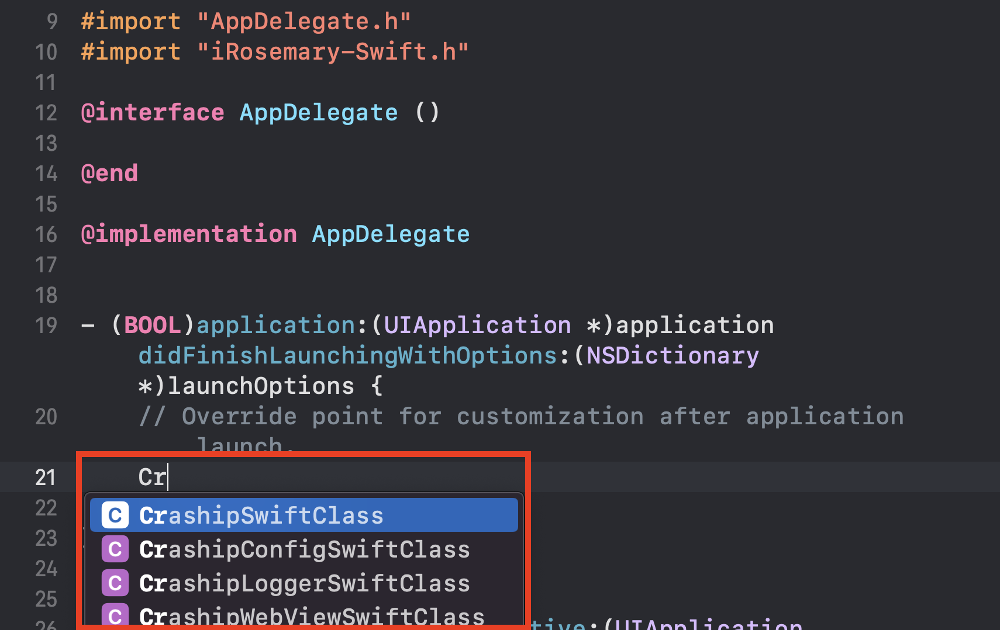
    
 
